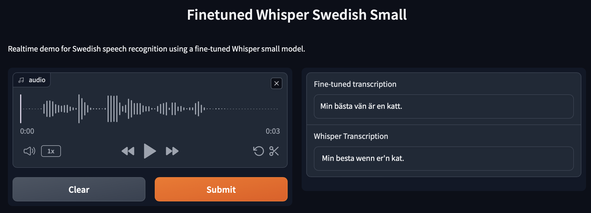

# ID2223 Lab2 - Fine-tuning Whisper (small) for the Swedish language



## User interface

https://huggingface.co/spaces/zeihers-mart/lab2

## Description

In this task, we are fine-tuning a neural network called Whisper that is pre-trained for audio transcription.
Despite the authors' German origin we chose to fine-tune whisper for Swedish as the German dataset is too big.
One of the core challenges is that we have limited computed resources so we choose to fine-tune the whisper small with around 244M parameters.
Whisper is inherently expensive to train as it deals with resource-intensive audio files.

## Results

We evaluated all models on the `test` corpus of the swedish `common-voice` dataset, which none of the models had seen in training.
The `whisper-small` model is the official pre-trained one from openAI, without fine-tuning.
The `whisper-small-finetuned` model is our best fine-tuned model, that includes the improvements we describe below.
The `whisper-small-tutorial` model is the model that results from strictly following the finetuning tutorial (but for swedish) that we were given as guidance.

| Model | Eval Loss | Eval WER |
| --- | --- | --- |
| whisper-small | 4.415 | 28.504 |
| whisper-small-tutorial | 0.325 | 98.139 |
| whisper-small-finetuned | 0.304 | 20.663 |

## Core challenges

As we have very limited data available there are two major challenges.
The first challenge is to achieve a high accuracy from such a small amount of data.
The second challenge is the problem of exploding gradients while fine-tuning.
Essentially because we have only so limited data available and whisper was pre-trained on a much bigger dataset,
when training for too long some gradients just explode and we massively overfit on the small training dataset.

# Improving model performance

## Model-centric approaches

### Hyperparameter tuning

From the original whisper paper:
> We train with data parallelism across accelerators
> using FP16 with dynamic loss scaling and activation checkpointing (Griewank & Walther, 2000; Chen et al., 2016).
> Models were trained with AdamW (Loshchilov & Hutter,
> 2017) and gradient norm clipping (Pascanu et al., 2013)
> with a linear learning rate decay to zero after a warmup over
> the first 2048 updates. A batch size of 256 segments was
> used, and the models are trained for 220 updates which is
> between two and three passes over the dataset. Due to only
> training for a few epochs, over-fitting is not a large concern

In our hyperparameter tuning approach, we can try to follow the configuration from the original authors.
However, our core challenge is going to be that we have a much smaller GPU available so we need to reduce
the memory footprint required for training which mainly means lowering the batch size.

**Batch size**

Finding the right batch size is difficult. A batch size that is too large can have problems with
oscillating around minima and can generally lead to lower accuracy because its step size is too big.
A smaller batch size can have better accuracy, especially combined with gradient decent algorithms
that use an adaptive learning rate, allowing them to escape local minima.
However, the problem with a batch size that is too small can lead to high variance in the gradients leading
to noisy updates which causes the gradient decent algorithms to sort of jitter.
So finding the right batch size is important.

Because we are very constrained with GPU RAM we utilized a higher number of gradient accumulation steps.
This means we can use a smaller batch size, but accumulate multiple batches into one backprob update.
This allows us to effectively increase the batch size.
We used:
```
per_device_train_batch_size=16,
gradient_accumulation_steps=2,
learning_rate=1e-5,
gradient_checkpointing=True,
```

Because we are using a larger batch size it makes sense to lower the initial learning rate for the optimizer.
We also use gradient checkpointing to save memory. This allows us to use a larger batch size
but it will slow down the backpropagation pass.

**Floating Point Precision**

The Whisper authors used 16-bit precision so we will do the same.
This saves about 1GB of VRAM and about 1 hour of training time.

**8bit optimizer**

The default optimizer for Whisper is AdamW. An optimizer using 16 / 32-bit floating point numbers.
To save about 40% of GPU memory we can use an 8-bit Adam optimiser. This is a huge optimisation to
allow the training to run smoothly on T4 GPUs. The 8-bit optimizer should yield a very comparable accuracy.
We kept the linear schedule for Adam with roughly the same warm-up time as other examples online.

```
warmup_steps=500,
weight_decay=0.00,
```

**Overfitting**

Because we are at risk of overfitting we see two measures against it.
First of all, we can configure the dropout layers in the Whisper model.
We choose to use a `0.1 dropout` for our model to improve generalisation.

The second option is to add `weight_decay` to our Adam optimiser.
Unfortunately, we could not test this setting, but we have seen a `weight_decay=0.01` in other fine-tuning trainings.

**Warm-up**

During the warm-up phase, the learning rate is slowly increased.
A larger warm-up phase could be beneficial in mitigating the exploding gradients problem.

**Force generation**

To significantly improve training the most important stap is to force the model to predict the target language.
The Whispher model has a language parameter for it's `generate` that we can use for both inference and training
to force the model to target a specific language. Using this during training significantly improved the accuracy of the transctiptions.

### Change fine-tuning model architecture

As of now, we have used a method of updating all the weights in the original model, with the aforementioned problems.
There is a different approach that promises solutions to this problem.

**Parameter-Efficient Fine-Tuning (PeFT)**

In PeFT most of the weights of the original model are frozen and additional weights are added on top of the existing model
that are fine-tuned for the task.
This has many benefits. First of all the number of weights that need to be trained during the fine-tuning process
are much smaller. E.g. fine-tuning whisper small with PeFT only requires training about 1% of weights compared to the original model.
Additionally, the checkpoint size can be drastically reduced since we only need to checkpoint the new fine-tuned weights.
Problems of _catastrophic forgetting_ can be mitigated without relying only on dropout layers.

So in summary, PeFT works by fine-tuning a small amount of additional weights on top of an existing large Encode-Decoder model.
The original weights are mostly frozen and re-used as is.
Finally, the PeFT fine-tuned models can perform equally well as a traditional all-weights fine-tuned model.

For inference one would load the original model as well as the small PeFT model and by combining
them one gets the fine-tuned final model for inference.

A full implementation for this technique can be found here [Finetuning Whisper-large-V2 on Colab using PEFT-Lora + BNB INT8 training](https://colab.research.google.com/drive/1DOkD_5OUjFa0r5Ik3SgywJLJtEo2qLxO?usp=sharing) and in our training pipeline. Unfortunatly, we where never able to fully train a PeFT based model due to the instability of colab and because we where not willing to spend even more money on compute.

## Data-centric approaches

We can increase the fine-tuning performance by adding more training data.
We have identified multiple possible additional data sources.

### The FLEURS dataset

This dataset was created by Google and provides audio and un-normalized transcriptions for 102 languages, including Swedish.
The dataset has about 10 hours of audio for every language.
https://huggingface.co/datasets/google/fleurs

### Parlament speeches and transcriptions

In all major parliaments around the world, the speeches are both recorded (usually in video form) and transcribed
by professionals. Additionally, the data is publicly available for free.
A big dataset containing data from the European parliament recordings is called [VoxPopuli](https://github.com/facebookresearch/voxpopuli)
and was created by Facebook.

### Data Augmentation

Just like in many other domains, it is also possible to augment audio data slightly to create more data points
for the training set. This can be done using the [Audiomentations](https://iver56.github.io/audiomentations/) Python library.
The library provides options for augmenting Gain, Pitch and Time it is also possible to add background noise and much more.
